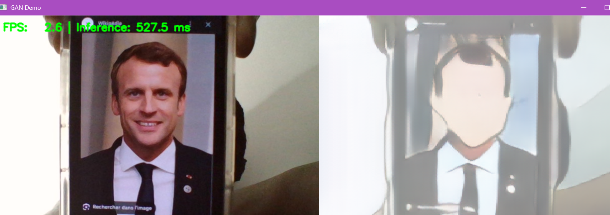
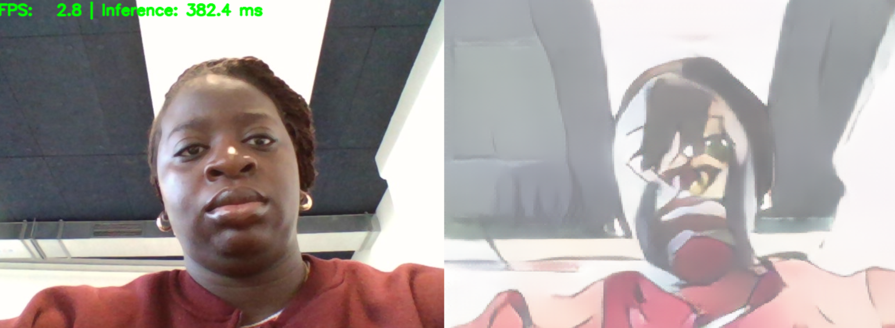

# Selfie2Anime — Embedded AI Project

This repository contains our group project for **Embedded AI**, where we train and deploy a model that translates **selfie images → anime**.

### Group Members

- **DOSSA Cynthia** (dossa@et.esiea.fr)
- **SRIKARAN Santhya** (srikaran@et.esiea.fr)
- **SAMMAR Karim** (sammar@et.esiea.fr)

---

## Dataset

### Name and source link

- **Selfie2Anime** (unpaired selfie/anime translation dataset)
- Source: _https://github.com/taki0112/UGATIT_

### Preprocessing and splits

- Input format: RGB images (loaded as .jpg).
- Resizing: _( 256×256)_
- Splits used in this repo follow:
  - `data\selfie2anime\trainA`
  - `data\selfie2anime\trainB`
  - `data\selfie2anime\valA`
  - `data\selfie2anime\valB`

> Note: `data\selfie2anime` is not tracked on GitHub. Full datasets are excluded by `.gitignore`.

---

## Model

### Architecture

- Task: **image-to-image translation** (Selfie → Anime)
- Training script: `src/train.py`
- Config file: `src/configs/selfie2anime.yaml`
- Generator: _CycleGAN generator_
- Discriminator: _PatchGAN_

---

## Results

- Saved checkpoints and logs:
  - `src/runs/selfie2anime/model_best.pt`
  - `src/runs/selfie2anime/train_metrics.json`
- Example run artifacts:
  - `outputs/samples/`

---

## Demo

### FPS and resolution

- Demo script: `src/demo.py`
- Measured performance on Jetson:
  
  

---

## Lessons Learned

- Unpaired image translation is sensitive to dataset balance and augmentation; stable training requires careful hyperparameter tuning.
- Edge deployment constraints (memory, FPS) push us to simplify pipelines and optimize inference.

---
